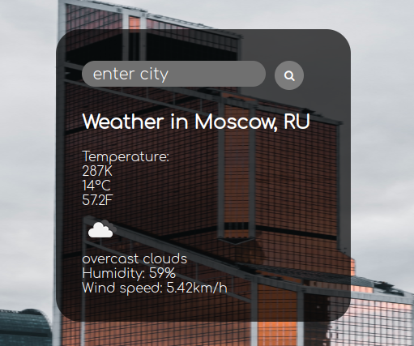
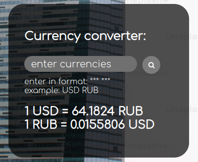
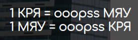
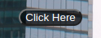

# Weather and Currency application

Веб приложение на Flask:

1. Которое отображает погоду в выбранном городе с сайта OpenWeather. А на фоне можно видеть
   случайное фото этого города взятого с сайта Unsplash.
2. Показывает курс выбранных валют с сайта currate, в том числе и некоторых криптовалют.
3. Также небольшой сюрприз для пользователя ))).

## How to start

Сначала загрузите необходимые модули:

```
pip install -r requirements.txt
```
После необходимо добавить в корневую директорию проекта ваш файл ".env".
Он должен иметь вид:

```
WEATHER_API_KEY=<your key>
CURRENCY_API_KEY=<your key>
```

Запускаем приложение:

```
python3 app.py
```

Приложение работает локально на URL:

```
http://127.0.0.1:5000/
```

## How to use

### Weather

1. Чтобы узнать погоду вводим в поисковой строке здесь название города на русском или английском языке. Примеры ввода: "
   Moscow", "Москва", "moscow".
   
2. Если город не был найден, то будет написано: "Weather in city not found".

### Currency

1. Чтобы узнать курс между двумя валютами вводим их коды состоящие из 3 символов через пробел в поисковой строке.
   Примеры ввода: "USD RUB", "RUB USD", "usd rub", "rub usd".
   
2.  Если коды не были найдены, то будет выведено сообщение такого формата:
   

### Surprise

Сюрприз будет по нажатию кнопки под полем курсов валют.
(там нет вирусов честное слово)


